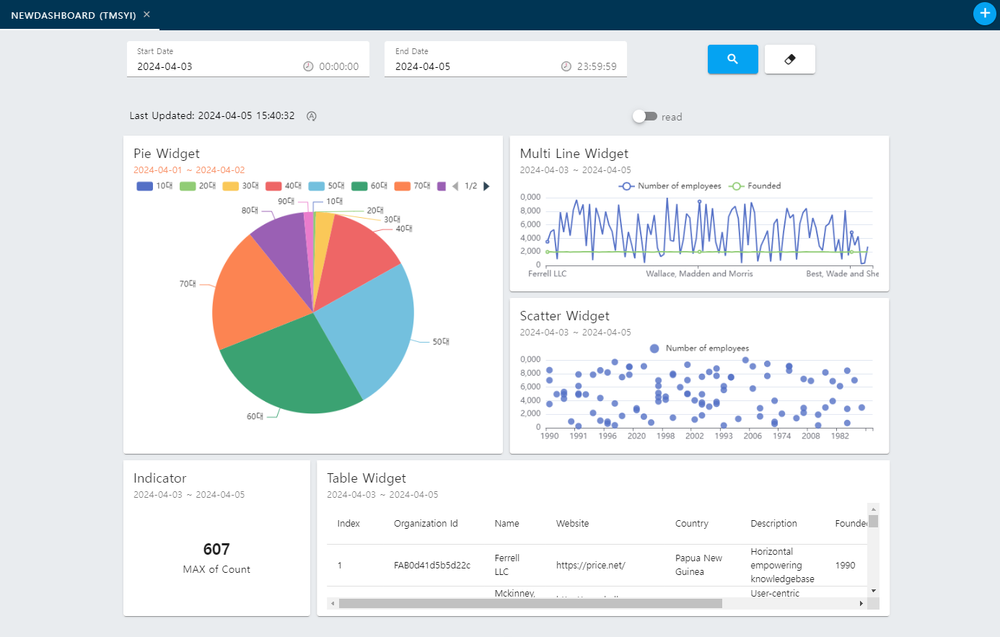

# User Dashboard


## 기능목록
### Tab
- 탭 추가
- 탭 제거

### Dashboard
- 공통 조회 일자 변경
- 대시보드 데이터 자동 새로고침

### Widget
- 위젯 크기, 위치 변경
- 위젯 데이터 변경
- 위젯 차트 타입 변경 (Line, Bar, Table, Pie 등)
- 위젯 차트 세부설정 변경
- 위젯 개별 조회일자 설정

## 컴토넌트 구조


## Directory structure
```
~/
|- components/  # 컴포넌트 선언 폴더
|- composables/ # 컴포저블(hook) 선언 폴더
|- constants/   # 공통 상수 선언 폴더
|- pages/       # 페이지 선언 폴더
|- plugins/     # 외부 플러그인 선언 폴더
|- providers/   # provide/inject 관련 폴더
|- public/      # 정적 리소스 폴더
|- server/      # API, DB 관련 폴더
|- stores/      # 전역 스토어
|- types/       # 타입스크립트 선언 폴더
`- utils/       # 유틸 함수 선언 폴더
```

### composables
#### useTemplate.ts
Dashboard 및 Widget의 NoSQL 데이터 템플릿 선언  
| Name | Type | Desc |
|---|---|---|
|getTabTemplate | <code>(Partial<Tab.Item>) => Tab.Item</code> | Dashboard Template 호출 함수 |
|getWidgetTemplate | <code>(Partial<Widget.Item>) => Widget.Item</code> | Widget Template 호출 함수 | 

#### useTimer.ts
setTimeout 기반 타이머 선언  
| Name | Type | Desc |
|---|---|---|
|timerId | <code>TimerID</code> | 타이머 ID | 
|isRunning | <code>boolean</code> | 타이머 실행 여부 |
| toggle | <code>() => TimerID</code> | 타이머 실행/중지 토글 함수 |
| start | <code>() => TimerID</code> | 타이머 실행 함수 |
| stop | <code>() => TimerID</code> | 타이머 중지 함수 |

####  useWidgetParser.ts
위젯 데이텨 파싱
| Name | Type | Desc |
|---|---|---|
| convertToLayoutItem | <code>(Widget.Item) => ExpandLayoutItem</code> | 위젯 데이터를 GridLayout 데이터로 변환 함수 |
| convertToWidgetItem | <code>(ExpandLayoutItem) => Widget.Item</code> | GridLayout 데이터를 위젯 데이터로 변환 함수 |


### providers
#### DashboardProvider
대시보드 위젯 제어 Provider  
**Props**  
| Name | Type | Desc |
|---|---|---|
| widgets | <code>Widget.Item[]</code> | 초기 위젯 데이터 목록 |

**Inject**  
| Name | Type | Desc |
|---|---|---|
| layout | <code>ExpandLayoutItem[]</code> | Layout 아이템 목록 |
| resetLayout | <code>() => void</code> | layout 목록 초기화 |
| updateLayout | <code>(Tab.Id, Partial<Tab.Item>) => Promise<Ref<Tab.Item>></code> | 대시보드 수정 API 호출 |
| updateWidget | <code>(Tab.Id, Widget.Id, Partial<Widget.Item>) => Promise<Tab.Item></code> | 위젯 목록 수정 API 호출 |
| addItem | <code>(Partial<ExpandLayoutItem>) => void</code> | layout 아이템 추가 |
| removeItem | <code>(Widget.Id) => void</code> | layout 아이템 제거 |

#### ToastProvider
토스트(snackbar) 메시지 호출 Provider
**Props**
-  
**Inject**  
| Name | Type | Desc |
|---|---|---|
| show | <code>({ message: string, color?: string }) => void</code> | 토스트 메시지 표시 |
| hide | <code>() => void</code> | 토스트 메시지 제거 |


### Stores
#### dataset.ts
외부 데이터 처리 담당

## Epilogue
예전에 진행 했던 프로젝트 중 하나로 Vue3/Nuxt3 익힐 겸 다시 해보았으니 역시나 복잡한 구조로 꽤나 고생을 했다.  
두 가지 프로젝트 요구사항을 혼합하여 넣다보니 기능 설계가 웃기게 된 부분들이 꽤나 있다.  
- Keep: 
  - Vue3/Nuxt3에 대한 이해도가 많이 깊어졌다.
- Problem: 
  - 추상적인 설계를 가지고 진행하다보니 구조 복잡도가 많이 해소되지 못한 점.
  - 타입스크립트 작성을 체계적으로 하지 못한 점.
- Try:
  - 차트 부분을 D3 등을 통해 직접 만들고 싶었지만 너무 커져버리는 스케일로 추후 개선.
  - 로컬 환경에서 가끔 메모리가 넘치는 경우가 있는데, 노트북 문제인지 뭔지 알아 볼 것.
